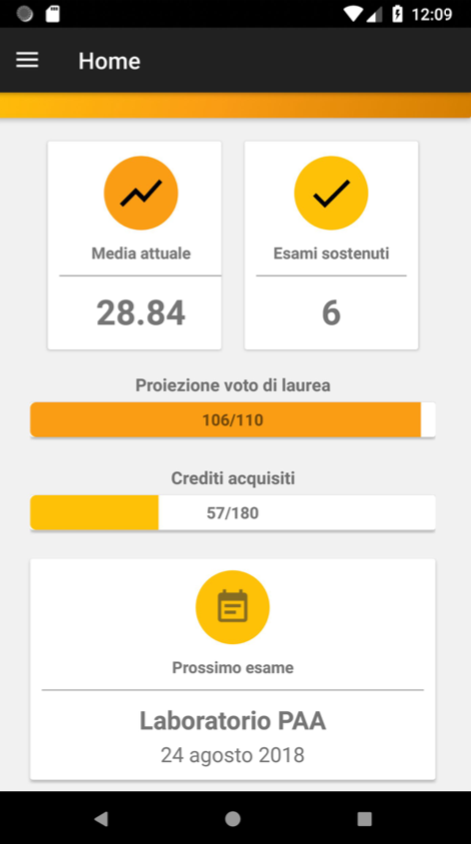
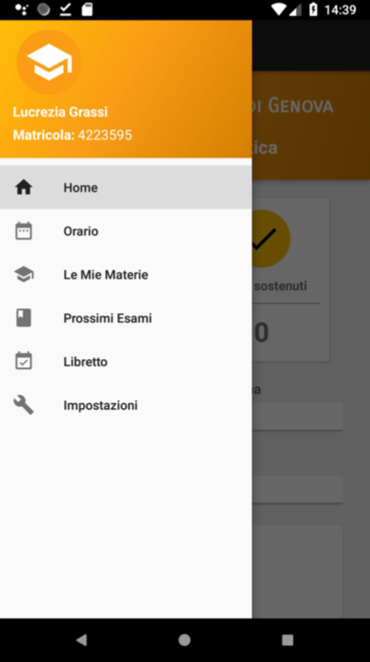
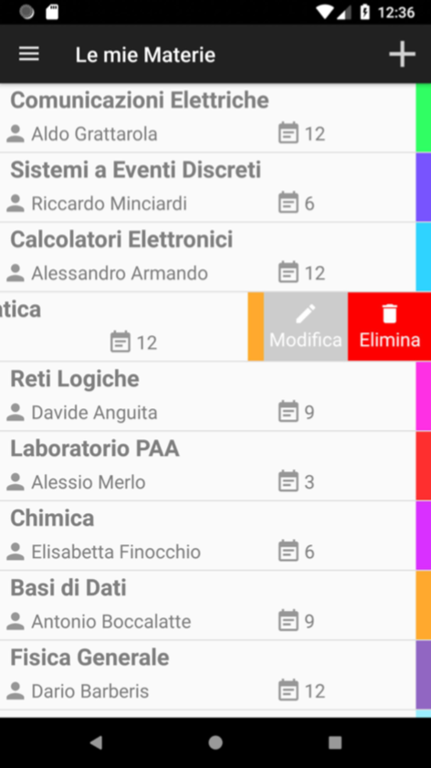
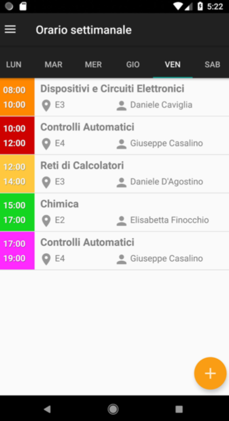
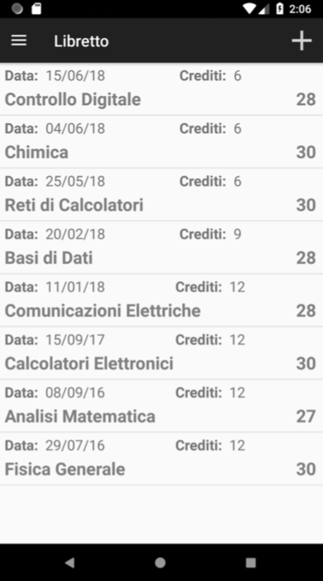
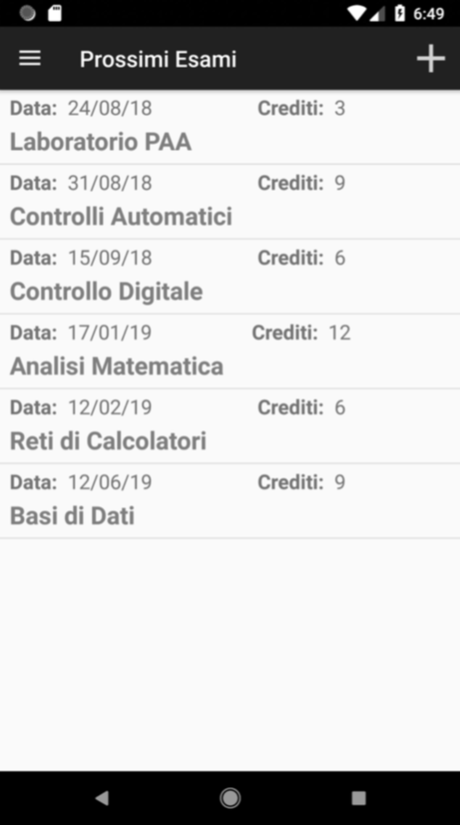
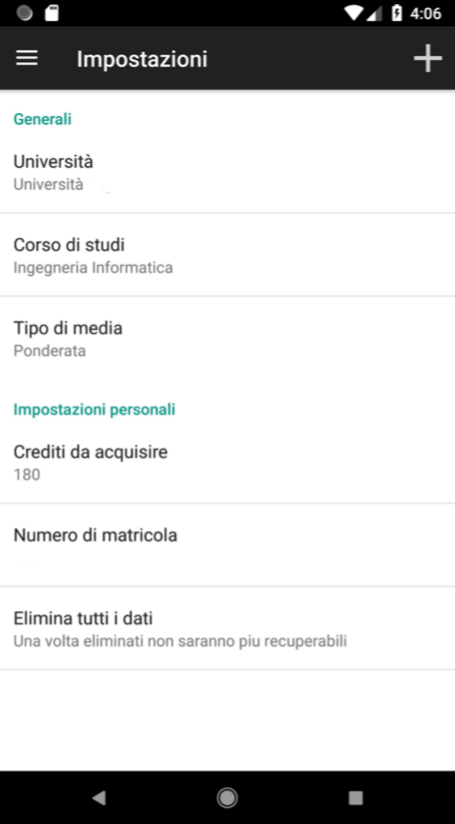

# UniPlanner
Android application which makes smart and easy the managing of your university carreer.
Compatible with most Android devices (API 17 and above).
Below are explained all the features offered by this app.

## Registration
Al primo avvio dell’app viene richiesto l’inserimento delle informazioni principali necessarie al funzionamento. In seguito, tali informazioni saranno modificabili tramite le impostazioni. Se viene premuto il tasto “Inizia” senza aver riempito tutti i campi viene mostrato un Toast contenente il messaggio: “Riempi tutti i campi”. Una volta completato il procedimento l’utente si ritroverà nella sua dashboard, ovvero la Home.

 

## Homepage
La schermata Home svolge la funzione di dashboard. Nella parte superiore sono riportati l’università e il corso di studi inseriti dallo studente. Nella parte inferiore vengono visualizzate tutte le informazioni più importanti: la media, il numero di esami superati, la proiezione del voto di laurea, i crediti acquisiti e l’appello più ravvicinato.

 

## Menu
Il menu permette di cambiare rapidamente schermata ovunque l’utente si trovi. Le voci presenti sono quelle già anticipate.
Cliccando sull’immagine l’utente può cambiare la propria immagine del profilo caricandone una dalla propria galleria. Per fare ciò la prima volta l’applicazione richiederà il permesso per poter leggere la memoria del dispositivo.

 

## Le mie Materie
In questa sezione vengono mostrati tutti i corsi seguiti dallo studente. Ogni voce contiene il nome del corso, il professore e il colore scelto per identificare rapidamente la lezione di quel corso all’interno dell’orario.
Cliccando sul ‘+’ in alto a destra è possibile aggiungere un nuovo insegnamento.
Facendo uno “swipe” verso sinistra sopra un elemento presente nella lista compariranno due pulsanti che ne permettono la modifica o l’eliminazione.
Eliminando una materia verranno automaticamente eliminati tutti gli esami e le lezioni ad essa collegati.

 

## Orario settimanale
L’orario permette di visualizzare le materie della settimana suddivise per giorni, semplicemente cliccando sul giorno desiderato.
Posizionandosi su un giorno e cliccando sul ‘+’ si potrà aggiungere una nuova lezione al giorno stesso. Ogni voce dell’orario contiene la materia, l’aula in cui si svolge la lezione, l’ora di inizio, l’ora di fine, il professore e il colore associato a quella materia.

 

## Libretto
Il libretto raccoglie tutti gli esami superati. Ogni voce mostra il nome del corso, la data in cui è stato sostenuto l’esame, il voto e i CFU acquisiti.
Anche in questo caso gli esami sono ordinati a partire dal più recente. Analogamente alla schermata degli esami futuri è possibile aggiungere un esame al libretto cliccando sul ‘+’ in alto a destra, selezionando la materia e inserendo la data e il voto.

 

## Future Exams 
In questa schermata è possibile visualizzare la lista dei prossimi appelli che lo studente ha intenzione di sostenere, ordinati a partire dal più vicino. Per ogni voce vengono mostrati il nome del corso, la data e i CFU.
L’esame più ravvicinato verrà mostrato anche nella sezione Home.
Cliccando sul ‘+’ in alto a destra è possibile aggiungere un nuovo esame.

 

## Notifiche
Il servizio di notifica fa sì che l’app ricordi allo studente tra quanti giorni si svolgerà l’esame più vicino.
Verrà inviata una notifica 7 giorni prima, 3 giorni prima e il giorno prima (alle 10 di mattina).

 

## Impostazioni
Tramite la schermata delle impostazioni è possibile modificare l’Università, il corso di studi, i crediti da acquisire e il numero di matricola.
Per fare ciò è sufficiente cliccare sulla voce che si vuole modificare e comparirà un campo di testo.

 

